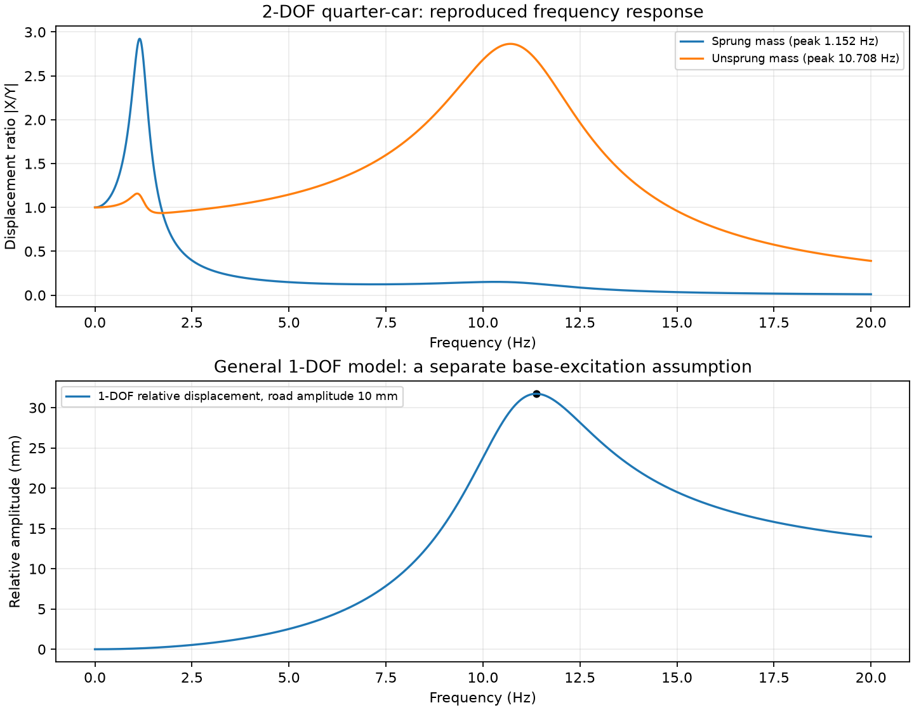
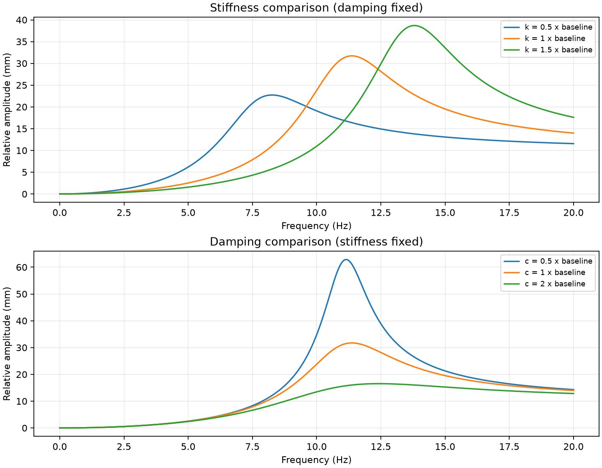
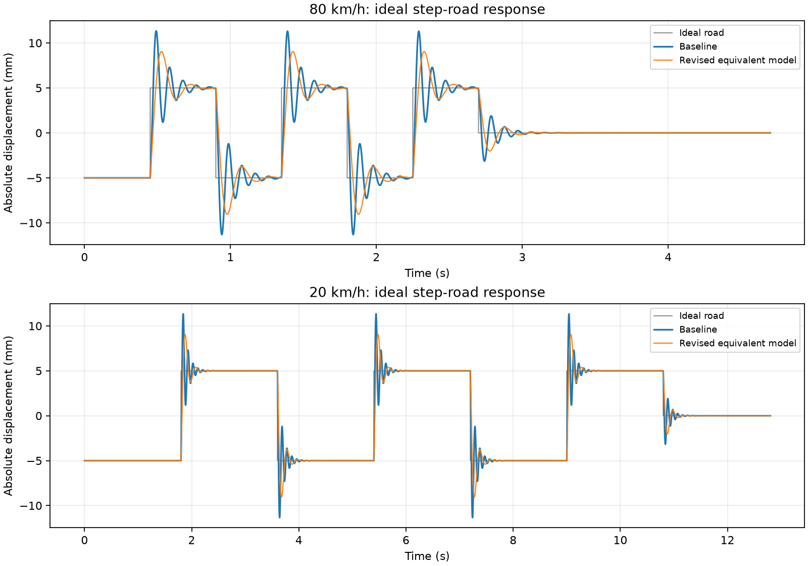
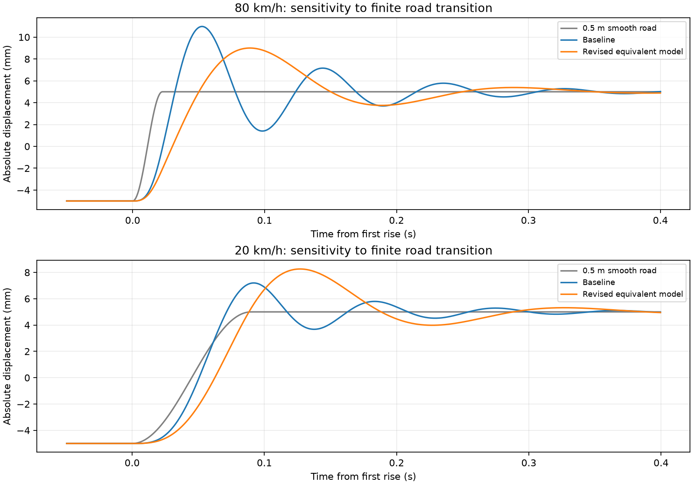

# 진동 모델과 응답 보완 계산

2026-09-13에 AI 도구를 활용해 작성·실행한 참고 분석입니다. 원래 수업 보고서의 후속 문제를 일반 1자유도 모델로 계산했으며, 수업 당시 제출 결과와 구분합니다.

보완 결과, **병렬·직렬 선택보다 경계조건과 가진 경로의 일관성이 먼저**라는 점을 확인했습니다. 기존 20% 저감 후보도 노면 가정을 바꾸면 같은 개선을 보장하지 못했습니다. 이 자료는 수업 기초 경험을 점검하는 참고 분석입니다.

## 주파수응답 재계산

원래 2자유도 식을 Python으로 다시 계산한 비감쇠 고유진동수는 1.1802·11.0832 Hz, 차체의 주요 피크는 1.152 Hz, 휠의 주요 피크는 10.708 Hz였습니다. 보고서의 약 1.15·10.71 Hz와 일치하는 범위입니다.

일반 1자유도 상대변위 응답을 0.001 Hz 간격으로 계산한 피크는 11.371 Hz, 31.7278 mm입니다. 보고서의 약 11.3 Hz·31.7 mm 표시는 근사값으로 구분합니다. 원래 MATLAB 파일을 실행한 것이 아니라 수식을 새 코드로 재계산했습니다.



강성 0.5·1·1.5배 및 감쇠 0.5·1·2배 비교도 재계산했습니다. 감쇠는 피크 크기뿐 아니라 위치에도 영향을 줍니다.



[직렬·병렬 판단과 축약 가정](../../docs/vehicle-vibration/model-assumptions.md)에 원래 모델, 차체 고정 모델, 일반 기초가진 모델의 차이를 설명했습니다.

## 모델과 입력 가정

절대변위 x에 대해 `m ẍ + c ẋ + k x = c ẏ + k y`를 사용했습니다. m=45 kg, 초기 k=218,000 N/m, c=1,000 N·s/m입니다. 이는 스프링과 댐퍼가 동일한 이동 기초에 연결된 모델입니다.

문제의 계단형 노면 그림을 다음과 같이 수치화했습니다. 그림에 상세히 지정되지 않은 초기·종료 조건도 함께 명시합니다.

- 높이 -5/+5 mm가 10 m 간격으로 교대하는 60 m 구간
- 첫 구간 -5 mm에서 정적 평형으로 시작, 초기 속도 0
- 60 m 이후 노면 높이 0, 추가 2초 관찰
- 80 km/h로 설계값 비교 후 동일한 값으로 20 km/h 재계산
- 평가량: 전체 관찰 구간의 `max |x(t)|`. 상대변위·가속도·승차감 지표와 구분

계단 입력에서는 댐퍼 가진항 c·ẏ가 순간적인 충격을 만듭니다. 이를 누락하지 않도록 노면 점프에서 x는 연속, 속도 변화는 `Δv = c·Δy/m`으로 적용하고, 각 일정 노면 구간은 선형계의 지수함수 해로 계산했습니다. 실제 노면의 모서리 완화나 타이어 접촉은 모델에 포함하지 않았습니다.

## 비교 결과

등가 강성 1,000~218,000 N/m의 로그 간격 60개와 감쇠 950·1,000·1,050 N·s/m를 조합한 180개 후보를 계산했습니다. 80 km/h에서 20% 감소를 만족한 후보 중 강성이 가장 큰 값을 선택했습니다. 연속 영역의 최적화 결과는 아닙니다.

선택값은 k=50,617.28 N/m, c=1,050 N·s/m입니다. 감쇠 변화는 +5%입니다.

| 속도 | 기존 최대 절대변위 | 보완 모델 최대 절대변위 | 감소율 |
| --- | ---: | ---: | ---: |
| 80 km/h | 11.3370 mm | 9.0576 mm | 20.11% |
| 20 km/h | 11.3370 mm | 9.0576 mm | 20.11% |

두 속도에서 최대값이 거의 같은 것은 이 이상적인 계단 입력의 점프 크기가 같고, 최대값을 지배하는 과도응답이 다음 점프 전에 충분히 줄어들기 때문입니다. 일반 노면이나 다른 지표에서도 속도 영향이 없다는 뜻은 아닙니다.



## 노면 가정을 바꾸면 유지되는 결과인가

위에서 고른 강성·감쇠를 그대로 유지하고, 순간적인 높이 변화 대신 0.1·0.5·1 m에 걸쳐 반 코사인 곡선으로 높이가 바뀌는 노면을 계산했습니다. 각 변화는 기존 계단 위치에서 시작합니다. 이는 민감도 확인용 가정이며 실측 노면이 아닙니다.

| 속도 | 높이 변화 구간 | 기존 최대변위 | 후보 최대변위 | 기존 대비 감소율 |
| --- | ---: | ---: | ---: | ---: |
| 80 km/h | 0.1 m | 11.321 mm | 9.055 mm | 20.01% |
| 80 km/h | 0.5 m | 10.976 mm | 9.003 mm | 17.98% |
| 80 km/h | 1.0 m | 9.988 mm | 8.844 mm | 11.46% |
| 20 km/h | 0.1 m | 11.103 mm | 9.023 mm | 18.74% |
| 20 km/h | 0.5 m | 7.198 mm | 8.260 mm | -14.75% |
| 20 km/h | 1.0 m | 5.376 mm | 6.649 mm | -23.69% |

음수 감소율은 변위 증가를 뜻합니다. **계단 노면에서 선택한 후보가 완만한 노면의 저속 조건에서는 오히려 불리했습니다.** 따라서 후보를 일반적인 개선 설계나 최적 설계로 소개하지 않습니다.



## 실제 현가장치 설계로 해석할 수 없는 이유

선택한 등가 강성은 기존 타이어 강성 200,000 N/m보다 작습니다. 따라서 원 보고서의 `k=ks+kt` 관계에서 타이어를 고정하고 양의 현가 강성만 바꾸는 설계로 구현할 수 없습니다. **20.11%는 일반 등가 모델의 계산 결과이며, 실제 현가장치의 20% 저감 달성으로 제시하지 않습니다.**

별도로 k=200,000~218,000 N/m의 20개 값과 동일한 감쇠 3개를 비교했을 때 가장 큰 감소율은 약 2.06%였습니다. 이 제한된 탐색에서 20% 목표를 만족하지 못했으며, 모든 가능한 설계에 대한 불가능성 증명은 아닙니다. 현가장치 설계로 확장하려면 원래 2자유도 모델과 가진 전달 경로부터 일관되게 설정해야 합니다.

## 재현과 확인

Python 3.12에서 다음 순서로 실행해 확인했습니다. 아래 명령은 이 폴더에서 실행합니다.

```sh
python -m pip install -r requirements.txt
python simulate.py
python review.py
```

`simulate.py`는 NumPy만 사용하며 계단 응답과 후보 탐색을 수행합니다. `review.py`는 주파수응답, 모델 비교, 완만한 노면 응답 및 그림 5개를 생성합니다. 두 스크립트는 각자 결과 파일을 자신의 폴더에 덮어씁니다.

- [계산 코드](simulate.py)
- [정밀 수치 결과](results.json)
- [추가 검증 코드](review.py) · [추가 검증 수치](review-results.json)
- [80 km/h 시간응답](trace-80kmh.csv) · [20 km/h 시간응답](trace-20kmh.csv)

피크 평가 간격을 0.5 ms에서 0.25 ms로 줄였을 때 보완 모델 피크 차이는 0.000071 mm 미만이었습니다. 지수함수 해의 한 구간을 독립 RK4 적분과 비교하는 검사도 통과했습니다. CSV는 열람용으로 약 5 ms 간격으로 줄였으므로 피크 검증에는 코드와 JSON을 기준으로 합니다.

추가 검증에서는 행렬 직접 해와 전개한 FRF 식의 일치, 차체 변수를 제거한 식과 원래 휠 응답의 일치, 정적 평형, 조화 입력의 해석해와 수치해를 확인했습니다. 조화 입력의 정상상태 최대 차이는 약 0.000101 mm였습니다. 완만한 노면은 선형 보간한 입력의 구간 해를 사용했고, 시간 간격을 절반으로 줄였을 때 여섯 조건의 피크 차이는 모두 0.0013 mm 미만이었습니다. 이는 계산 구현 확인이며 모델의 실차 타당성을 입증한 시험은 아닙니다.

[수업 과제 개요](../../projects/vehicle-vibration.md)
