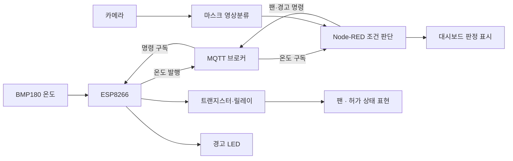

# 시스템 구조와 과제별 로직

[스마트팩토리 IoT 실습](../../projects/smart-factory-iot.md)의 제출 자료를 바탕으로 정리했습니다.

## 최종 팀과제의 기능 구성

정상 임무 설명을 위한 기능도입니다. 실제 배선도나 검증을 마친 산업용 출입 제어 설계를 대신하지 않습니다.

## 단계별 구성

### 팬 원격 제어

팀과제 #1은 ESP8266이 MQTT 명령을 구독하고, 수신한 0/1에 따라 GPIO 출력을 변경하는 구조입니다. 회로와 팬 ON/OFF 비교 사진이 제출되어 있습니다.

### 온도 웹 모니터링

팀과제 #2는 ESP8266 HTTP 서버에서 BMP180 온도와 LED 상태를 표시합니다. 코드의 LED 켜짐 기준은 28℃, 꺼짐 기준은 27.5℃로, 두 기준 사이에서 상태를 유지하는 히스테리시스를 사용합니다.

페이지 자동 새로고침은 5초로 설정되어 있습니다. 제출 코드에서는 HTTP 요청을 처리할 때 온도를 읽고 LED 판단을 갱신하므로, 독립적인 주기 제어 루프로 설명하지 않습니다.

### MQTT 센서·출력 연계

팀과제 #3 코드에는 약 2초 간격의 온도 발행 설정과 팬 명령 구독, ON/OFF 상태 발행이 있습니다. 이 주기는 설정값이며 측정한 최대 성능이나 보장 지연시간이 아닙니다.

### 복합 조건 판정

팀과제 #4는 마스크 분류와 온도 조건을 결합합니다. 보고서 기준 논리는 다음과 같습니다.

| 마스크 분류 | 센서 온도 | 판정 |
| --- | --- | --- |
| 착용 | 28℃ 이하 | 출입 가능 |
| 착용 | 28℃ 초과 | 출입 불가 |
| 미착용 | 온도와 관계없이 | 출입 불가 |

보고서에는 이 세 가지 경우의 화면과 사진이 있습니다. 센서 코드의 온도 발행 간격은 1초로 설정되어 있습니다.

## 버전과 검증의 한계

- 최종 제출 기준은 28℃입니다. 실습에서 36℃ 조건을 재현하기 어려워 낮춘 것으로 설명되며, 별도 저장본에는 36℃가 남아 있습니다. 재실행할 때 최종 제출 조건과 파일을 맞춰야 합니다.
- 코드의 출력 핀·극성과 일부 주석은 실제 배선과 대조해야 합니다.
- 팬 상태 메시지는 코드가 설정한 명령 상태이며 회전 센서로 확인한 실제 팬 속도가 아닙니다.
- 분류 데이터 구성·정확도·신뢰도 기준과 연결 끊김·오래된 데이터 처리는 별도 검증이 필요합니다.
- 원본 네트워크 설정과 접속 정보는 이 문서에 포함하지 않았습니다.
