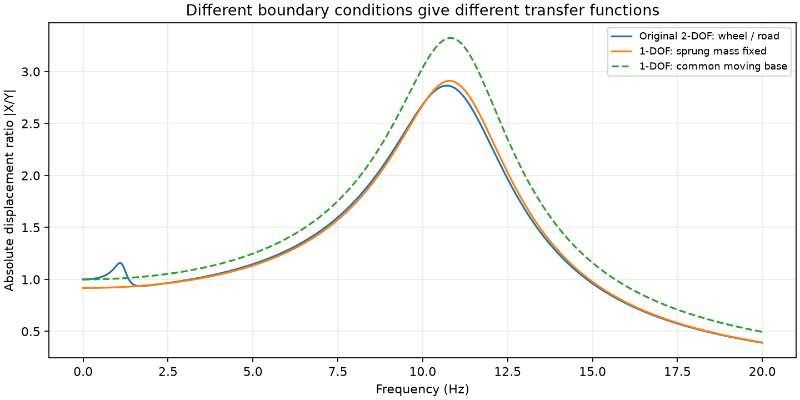

# 직렬·병렬 판단과 모델 축약

2026년 9월 보완 검토입니다. 원래 보고서의 병렬 선택은 **차체를 고정했을 때 휠 변위에 대한 복원강성이 ks+kt가 된다**는 범위에서는 설명할 수 있습니다. 그러나 그 사실만으로 일반 기초가진 모델 전체가 유도되지는 않습니다. 직렬로 바꾸는 것 역시 원래 동적 모델을 자동으로 보존하지 않습니다.

## 먼저 고정점과 이동점을 구분

원래 구조는 차체와 휠 사이에 현가 스프링 ks와 댐퍼 cs가 있고, 휠과 노면 사이에는 타이어 스프링 kt가 있습니다. 차체와 휠이 각각 움직이므로 두 스프링의 변형은 다릅니다. 중간 질량의 관성 때문에 두 스프링의 힘이 항상 같다고 둘 수도 없습니다.

따라서 형상이 위아래로 놓였다는 이유만으로 직렬식 `ks·kt/(ks+kt)`를 적용하거나, 모두 같은 노면 변위만큼 변형된다고 가정해 병렬식으로 묶는 것은 충분한 근거가 아닙니다.

## 차체를 고정하는 근사

원래 휠 운동방정식에서 `xs=0`, `ẋs=0`을 대입하면 다음과 같습니다.

```text
mu ẍu + cs ẋu + (ks + kt) xu = kt y
```

휠의 변위 xu에 대한 강성 항은 ks+kt지만, 노면 가진은 타이어를 통해서만 들어오므로 우변은 kt·y입니다. 상대변위 `z=xu-y`로 쓰면 다음과 같습니다.

```text
mu z̈ + cs ż + (ks + kt) z = -mu ÿ - cs ẏ - ks y
```

이는 보고서 Part II의 `mu z̈ + cs ż + keq z = -mu ÿ`와 다릅니다. 차체 고정은 휠의 고주파 운동을 살펴보는 근사로 검토할 수 있지만, 저주파 차체 운동까지 재현하지 못합니다.

## 보고서가 계산한 일반 기초가진 모델

보고서 Part II의 식은 등가 스프링과 댐퍼가 **모두 동일한 이동 기초 y**에 연결된 별도의 모델입니다.

```text
mu ẍ + cs(ẋ-ẏ) + keq(x-y) = 0
```

이 식 자체는 해당 연결 조건에 맞습니다. 문제는 차체 고정 설명에서 이 연결 조건으로 넘어가는 근거가 충분하지 않다는 점입니다. 포트폴리오에서는 이를 원래 차량의 정확한 축약 모델로 표현하지 않습니다. 추가 시간응답도 이 일반 모델의 계산으로 한정합니다.

## 원래 2자유도 모델과 비교

| 모델 | 정적 노면 변위에 대한 휠 절대변위 비 | 포함하는 운동 |
| --- | ---: | --- |
| 원래 2자유도 | 1.0000 | 차체와 휠의 연성 운동 |
| 차체 고정 1자유도 | kt/(ks+kt) = 0.9174 | 고정 차체에 대한 휠 운동 |
| 일반 기초가진 1자유도 | 1.0000 | 같은 기초에 연결된 등가 질량 운동 |

정적 비율이 같은 모델끼리도 동적 응답 전체가 같지는 않습니다. 아래 그래프는 입력을 노면 변위, 출력을 질량의 **절대변위**로 통일해 비교했습니다.



참고로 원래 2자유도 식에서 차체 변수를 정확히 제거하면 휠에 대한 주파수영역 식은 다음과 같습니다.

```text
[ks+kt-mu·ω²+i·cs·ω - (ks+i·cs·ω)²/(ks-ms·ω²+i·cs·ω)] Xu = kt Y
```

제거된 차체의 효과가 주파수에 따라 달라지므로, 단일 상수 강성만 고르는 것으로 전 주파수 응답을 보존할 수 없습니다. 이 식과 원래 행렬식의 응답이 일치하는지 계산 코드에서 확인했습니다.

[프로젝트 개요](../../projects/vehicle-vibration.md) · [보완 계산](../../analysis/vehicle-vibration/README.md)
